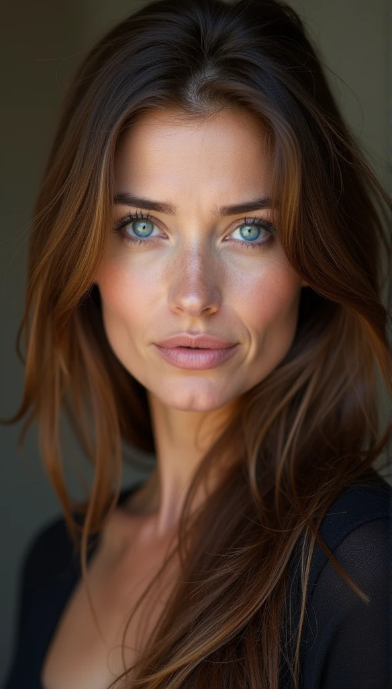

## What is Flux.1?
Flux.1 is an AI image generator that uses text to create images: 
### What it does
Flux.1 is a text-to-image model that can generate high-quality images from text descriptions. It's considered to be a state-of-the-art model for image detail, prompt adherence, and style diversity.


I conducted an experiment using Flux.1 schnell, fixing the random seed and generating images of people with varying ages. For this experiment, I used seaart.ai.

## short prompt
```
70 year old caucasian, lady, brown hair, highly detailed face and beautiful  blue eyes, good natural , long hair
```

I generated images by decreasing the initial age part by 10 years each time.
Incidentally, I used 4009167996 as the random seed.

#### 70 year old


#### 60 year old


#### 50 year old


#### 40 year old


#### 30 year old


#### 20 year old


While the generated images for individuals aged between 20 and 60 exhibited subtle variations, a marked disparity became evident when comparing them to the images of 70-year-olds.

## extended prompt
```
70 year old caucasian, lady, brown hair, highly detailed face and beautiful  blue eyes, good natural , long hair, she is in gym taking a mirro photo, bending over, seductive smirk, in gym fit, legging gymshark and nice ass, in front
```

#### 70 year old


#### 20 year old


Despite the varied backgrounds, the female figures in the images show little variation.


## replaced prompt
```
70 year old caucasian, female, brown hair, highly detailed face and beautiful  blue eyes, good natural , long hair
```
#### 70 year old


#### 60 year old


#### 50 year old


#### 40 year old


#### 30 year old


#### 20 year old


#### 10 year old


Upon replacing "lady" with "female" in the prompts, a subtle yet discernible increase in the diversity of generated images across age groups became apparent. This observation implies that the AI model might associate "lady" with more specific attributes or stereotypes, thereby limiting the range of possible outputs.

