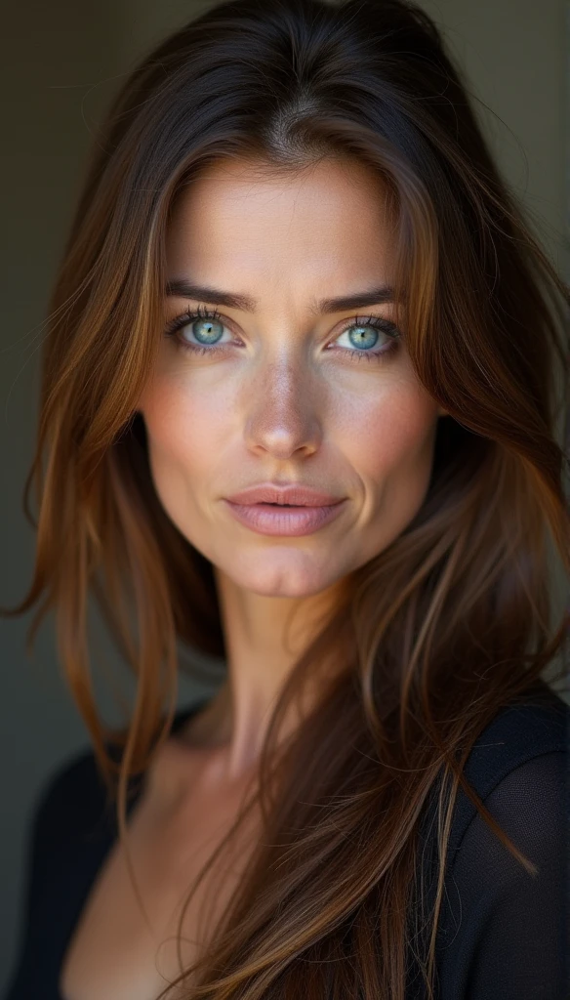
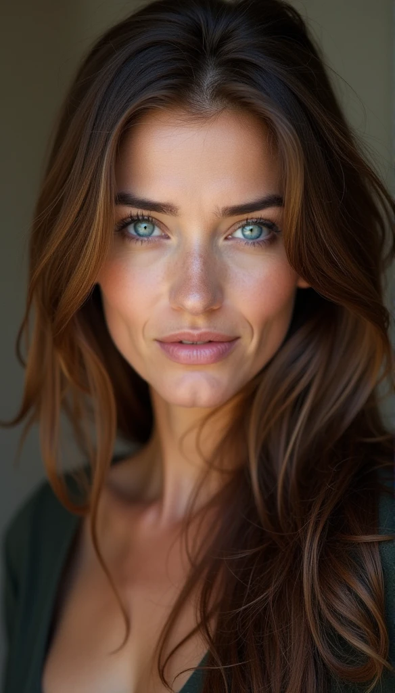
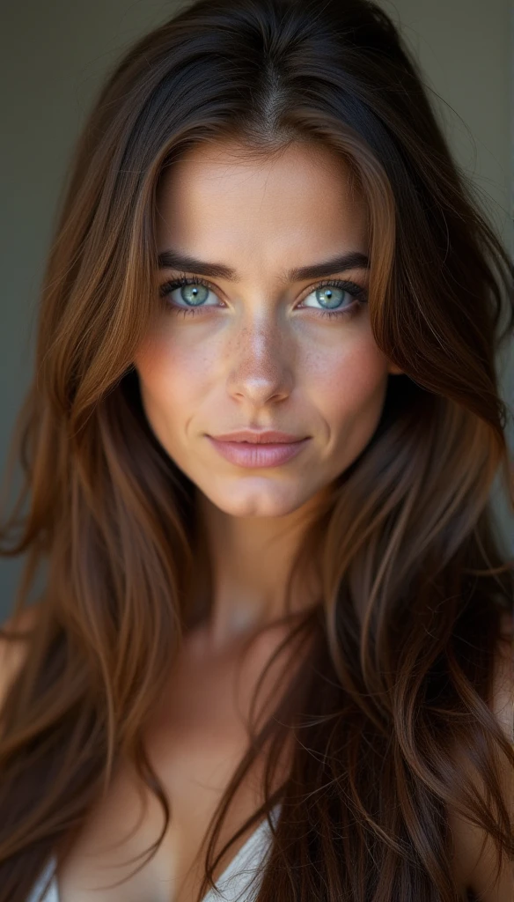
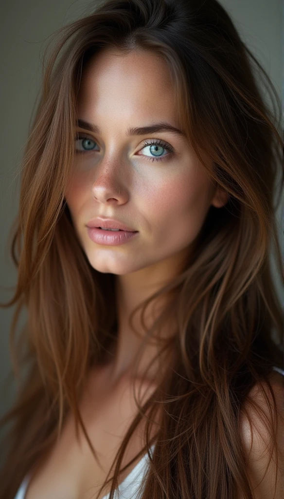
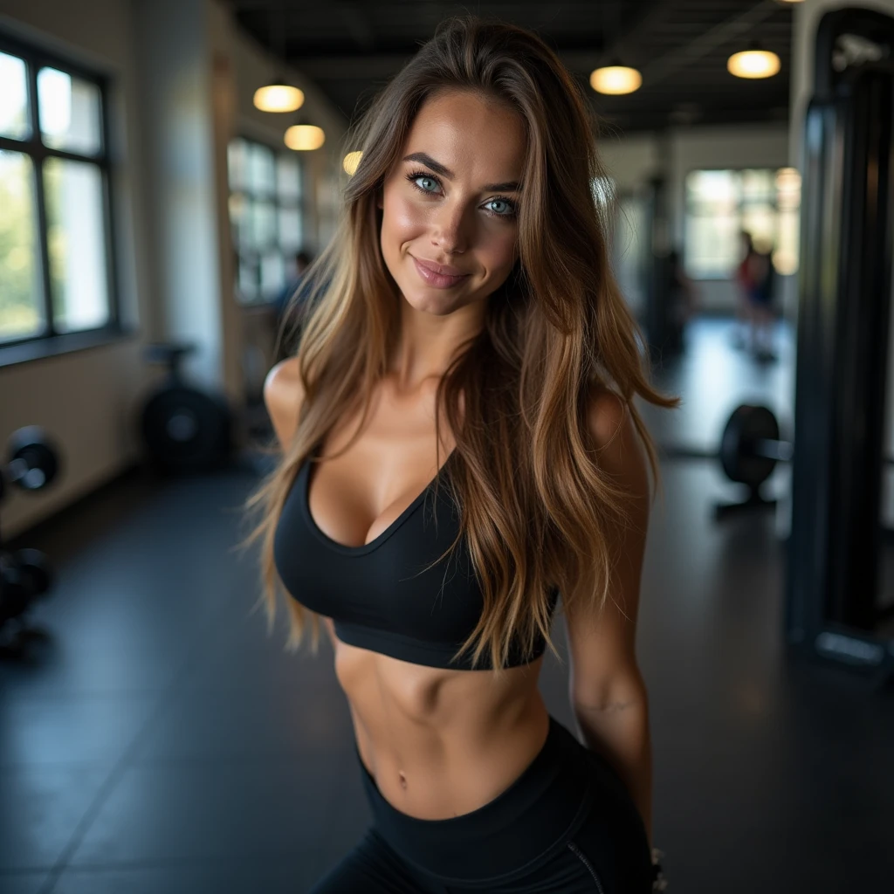

## Flux.1とは？

Flux.1はテキストから画像を生成するAI画像ジェネレーターです。

### Flux.1でできること

Flux.1はテキストの説明から高品質な画像を生成できる text-to-image モデルです。画像のディテール、プロンプトへの忠実性、スタイルの多様性において、最先端のモデルとして評価されています。

今回は Flux.1 schnell を使い、ランダムシードを固定した上で年齢を変えながら人物画像を生成する実験を行いました。実験には seaart.ai を使用しています。

## 短いプロンプト

```
70 year old caucasian, lady, brown hair, highly detailed face and beautiful  blue eyes, good natural , long hair
```

最初の年齢の部分を10歳ずつ下げながら画像を生成しました。
なお、ランダムシードは 4009167996 を使用しています。

#### 70歳


#### 60歳



#### 50歳



#### 40歳



#### 30歳


#### 20歳



20歳から60歳の範囲では生成画像に微妙な違いはあるものの、70歳の画像と比較すると明確な差が見られました。

## 長いプロンプト

```
70 year old caucasian, lady, brown hair, highly detailed face and beautiful  blue eyes, good natural , long hair, she is in gym taking a mirro photo, bending over, seductive smirk, in gym fit, legging gymshark and nice ass, in front
```

#### 70歳


#### 20歳



背景は異なっているものの、画像に写る女性像にはほとんど違いが見られませんでした。

## 単語を置き換えたプロンプト

```
70 year old caucasian, female, brown hair, highly detailed face and beautiful  blue eyes, good natural , long hair
```

#### 70歳


#### 60歳


#### 50歳


#### 40歳


#### 30歳


#### 20歳


#### 10歳


プロンプト中の「lady」を「female」に置き換えたところ、年齢ごとの生成画像のバリエーションがわずかながらもはっきりと増えました。このことから、AIモデルが「lady」という単語をより限定的な属性やステレオタイプと結びつけていることで、出力の幅が狭まっている可能性が示唆されます。
