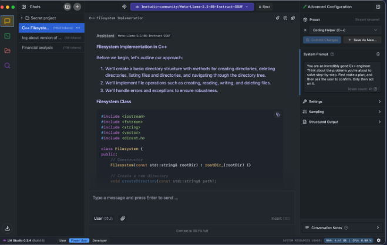
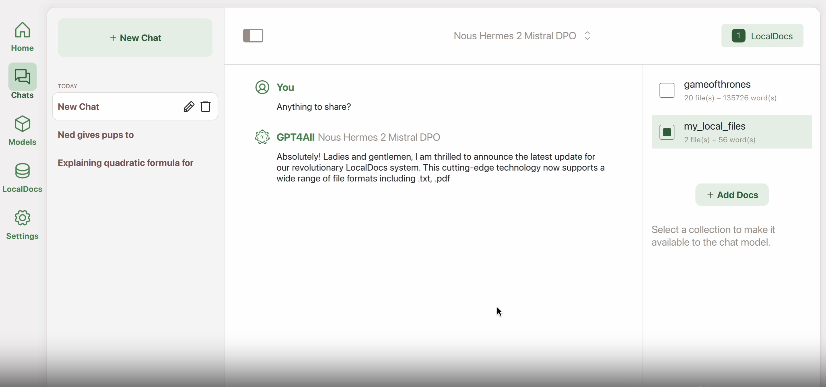
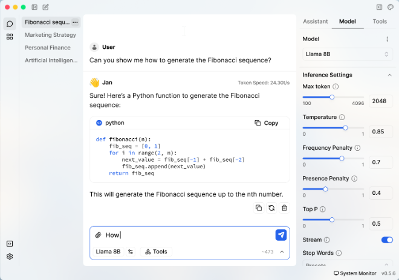
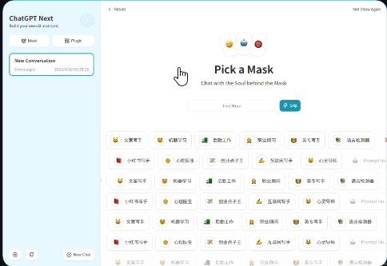

## 1. LM Studio

https://lmstudio.ai/  
対応OS: Windows, Linux, MacOS  

LM Studioは、大規模言語モデルをローカルで実行・管理するために設計された強力なデスクトップアプリケーションです。さまざまなオープンソースLLMをダウンロード、実行、チャットするための使いやすいインターフェースを提供します。LM Studio 0.3.5の新機能として、ヘッドレスモード、オンデマンドでのモデル読み込み、MLX Pixtralサポートが追加されました。これらの機能により柔軟性とパフォーマンスが向上し、グラフィカルインターフェースなしでモデルを実行したり、必要に応じてモデルを読み込んでリソースを節約したり、最新のAI技術を活用したりできます。

> LM Studio 0.3.5の新機能：ヘッドレスモード、オンデマンドでのモデル読み込み、MLX Pixtralサポート！

## 2. GPT4ALL ⭐70.6K

https://github.com/nomic-ai/gpt4all  
対応OS: Windows, Linux, MacOS  

GPT4Allは、日常的に使っているデスクトップやノートPCで大規模言語モデル（LLM）をプライベートに実行できます。
API呼び出しもGPUも不要です。
GPT4Allは、コンシューマー向けハードウェアでローカル実行できるオープンソースのチャットボットと言語モデルのエコシステムです。高性能なGPUやクラウドサービスを必要とせずに高度な言語モデルを実行できる、独自のAIアクセシビリティを実現しています。GPT4Allには、使いやすいチャットクライアント、開発者向けのPython APIが含まれており、さまざまなタスクや言語に最適化された多様な事前学習モデルをサポートしています。

## 3. Ollama ⭐97.3K

https://ollama.com/  
対応OS: Windows, Linux, MacOS

Ollamaは、大規模言語モデルをローカルで実行するための強力なツールです。さまざまなLLMをパソコンにダウンロード、インストール、実行するプロセスを簡素化します。Ollamaは使いやすさと豊富なモデルライブラリにより人気を集めています。PythonおよびJavaScriptライブラリを提供しており、LLMをアプリケーションに統合したい開発者にとって最適な選択肢です。

- https://github.com/ollama/ollama-python
- https://github.com/ollama/ollama-js

Ollamaはカスタムモデルの作成やファインチューニングにも対応しており、特定のユースケースに合わせてモデルを調整できます。

## 4. Jan ⭐23.3K

https://jan.ai/  
対応OS: Windows, Linux, MacOS  

Janは、デスクトップで完全にオフラインで動作するChatGPTのオープンソースな代替ツールです。ユーザーのプライバシーとコントロールを最優先しつつ、誰もがAIを利用できるようにすることを目指しています。Janは組み込みのモデルライブラリを備え、リモートのAI APIへの接続、OpenAI互換のローカルAPIサーバーを提供します。また、カスタマイズのための拡張機能システムも備えており、Llama、Gemma、Mistralなど幅広い人気のLLMをサポートしています。

## 5. llamafile ⭐20.4K

https://github.com/Mozilla-Ocho/llamafile  
対応OS: Windows, Linux, MacOS  
Llamafileは、大規模言語モデルを単一ファイルとして簡単に配布・実行できる革新的なプロジェクトです。CPUとGPUの両方での実行をサポートし、エンドユーザーにとってAI LLMをより身近なものにします。Llamafileはユーザーフレンドリーかつ効率的に設計されており、最近のアップデートではさまざまなハードウェアアーキテクチャ向けのパフォーマンス最適化に重点が置かれています。リクエストを処理するための組み込みサーバーも備えており、他のAIツールやフレームワークともよく統合できます。

## 6. NextChat ⭐76.5K

https://github.com/ChatGPTNextWeb/ChatGPT-Next-Web  
対応OS: Windows, Linux, MacOS

NextChat（ChatGPT Next Webとも呼ばれる）は、標準的なChatGPTの体験をさらなる機能で拡張するオープンソースのチャットボットです。カスタマイズ可能なインターフェースを提供し、テンプレートプロンプトに素早くアクセスできる「Awesome Prompts」や、特定用途向けのChatGPTインスタンスである「Masks」などの機能を備えています。NextChatはOpenAI APIを利用した従量課金制をサポートしており、コスト効率の良い選択肢となっています。簡単にデプロイ・カスタマイズできるよう設計されており、ユーザーは自身のニーズに合わせたパーソナルなAIアシスタントを作成できます。

## おまけ: llama.cpp ⭐67.6K

https://github.com/ggerganov/llama.cpp

llama.cppはC++で書かれており、LLaMAの最速の実装として、他のローカルおよびWebベースのアプリケーションでも利用されています。
ただし、上記で紹介したアプリケーションほどインストールが簡単ではないため、ローカルでLLMを動かす方法としてはおまけ（オプション）として紹介しています。
