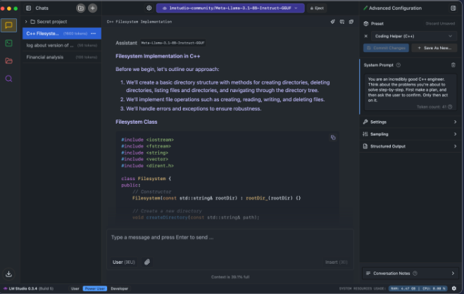
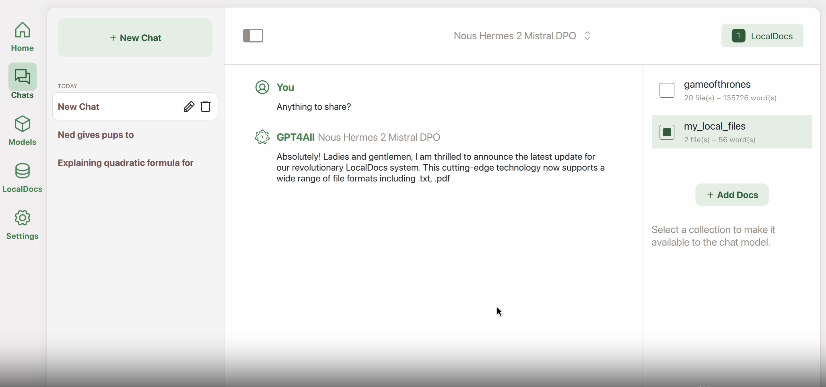
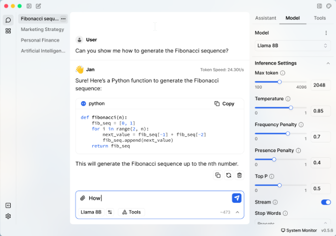
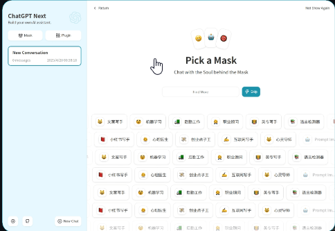

## 1. LM Studio
https://lmstudio.ai/  
support OS: Windows, Linux, MacOS  

LM Studio is a powerful desktop application designed for running and managing large language models locally. It offers a user-friendly interface for downloading, running, and chatting with various open-source LLMs. New in LM Studio 0.3.5: headless mode, on-demand model loading, and MLX Pixtral support! These features enhance flexibility and performance, allowing users to run models without a graphical interface, load models as needed to save resources, and utilize the latest advancements in AI technology

> New in LM Studio 0.3.5: headless mode, on-demand model loading and MLX Pixtral support!

## 2. GPT4ALL ⭐70.6K
https://github.com/nomic-ai/gpt4all  
support OS: Windows, Linux, MacOS  

GPT4All runs large language models (LLMs) privately on everyday desktops & laptops.
No API calls or GPUs required.
GPT4All is an ecosystem of open-source chatbots and language models that can run locally on consumer-grade hardware. It offers a unique approach to AI accessibility, allowing users to run sophisticated language models without the need for powerful GPUs or cloud services. GPT4All includes a user-friendly chat client, a Python API for developers, and supports various pre-trained models optimized for different tasks and languages.

## 3. Ollama ⭐97.3K
https://ollama.com/  
support OS: Windows, Linux, MacOS

Ollama is a powerful tool for running large language models locally. It simplifies the process of downloading, installing, and running various LLMs on personal computers. Ollama has gained popularity due to its ease of use and extensive model library. It offers Python and JavaScript libraries, making it an excellent choice for developers looking to integrate LLMs into their applications:

- https://github.com/ollama/ollama-python
- https://github.com/ollama/ollama-js

Ollama also supports custom model creation and fine-tuning, allowing users to tailor models to specific use cases.

## 4. Jan ⭐23.3K
https://jan.ai/  
support OS: Windows, Linux, MacOS  

Jan is an open-source alternative to ChatGPT that runs entirely offline on your desktop. It aims to make AI accessible to everyone while prioritizing user privacy and control. Jan features a built-in model library, supports connecting to remote AI APIs, and offers a local API server with OpenAI-equivalent functionality. It also includes an extension system for customization and supports a wide range of popular LLMs like Llama, Gemma, and Mistral.

## 5. llamafile ⭐20.4K
https://github.com/Mozilla-Ocho/llamafile  
support OS: Windows, Linux, MacOS  
Llamafile is an innovative project that allows for easy distribution and execution of large language models as a single file. It supports both CPU and GPU execution, making AI LLMs more accessible to end-users. Llamafile is designed to be user-friendly and efficient, with recent updates focusing on performance optimizations for various hardware architectures. It also includes a built-in server for handling requests and integrates well with other AI tools and frameworks

## 6. NextChat ⭐76.5K
https://github.com/ChatGPTNextWeb/ChatGPT-Next-Web  
support OS: Windows, Linux, MacOS

NextChat, also known as ChatGPT Next Web, is an open-source chatbot that enhances the standard ChatGPT experience with additional features. It offers a customizable interface and includes features like "Awesome Prompts" for quick access to template prompts and "Masks" for specialized ChatGPT instances. NextChat supports a pay-as-you-go system using the OpenAI API, making it a cost-effective option for users. It's designed to be easily deployable and customizable, allowing users to create personalized AI assistants tailored to their specific needs

## optional llama.cpp ⭐67.6K 
https://github.com/ggerganov/llama.cpp  

llama.cpp is written in C++ and is the fastest implementation of LLaMA and it is used in other local ans web-based applications.
But it is not easy as well as the above applications to install so that is a reason why this is an optional way to run LLM locally.
